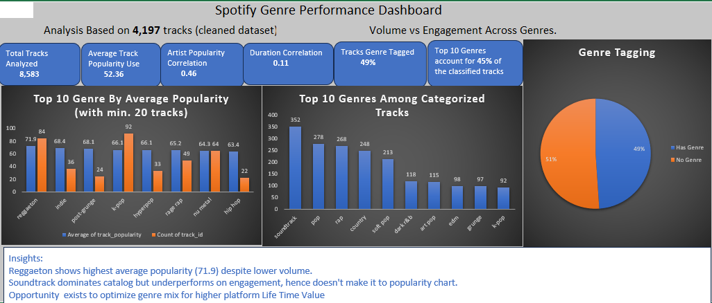

# Spotify-Track-Performance-Popularity-Drivers-Analysis
## Project Objectives
This project analyzes Spotify track data to understand how genre mix and content attributes influence track popularity. The goal is to identify engagement patterns and uncover strategic oppoetunities for catalog optimization and user growth.
## Dashboards
## Key Drivers of Track Popularity

## Genre Performance Overview

